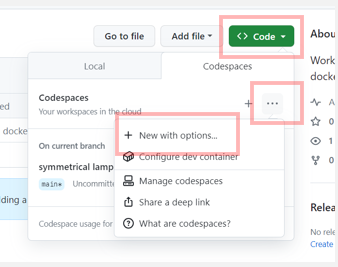
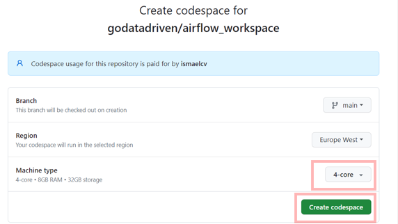

# Codespaces Airflow training environment

This repository contains the code for the Airflow training environment.

## Getting started

### 1) Create a new codespaces instance:
* Click on the green button "code" 
* Select " ... " to prompt more options
* Select "+ New with Options"



<br>

### 2) Configure your codespaces instance:
* Select a 4-core machine
* Click on "Create Codespace"


<br>

### 3) Wait for the codespaces instance to be created:

### 4) Once the codespaces instance is created, you will be redirected to the VSCode codespaces environment. 
This will be your workspace for the rest of this training


<br>


### 5) Check you have enough memory allocated to your codespaces instance:

* In the terminal (ctrl + ` ) check you have more than 4GB of allocated memory:

```
docker run --rm "debian:bullseye-slim" bash -c 'numfmt --to iec $(echo $(($(getconf _PHYS_PAGES) * $(getconf PAGE_SIZE))))'
```

An no, 3.9 is not enough. If you see 3.9 means that you did not selected the right machine in step 2.

<br>

### 6) Run database migrations *(ONLY RUN ONCE)*


 You need to run database migrations and create the first user account. It is all defined in the docker compose file so just run:
 ```
    docker compose up airflow-init
```
<br>

### 7) Now you can start all services:
```
    docker compose up
```

this will make Airflow available at: 
http://localhost:8080